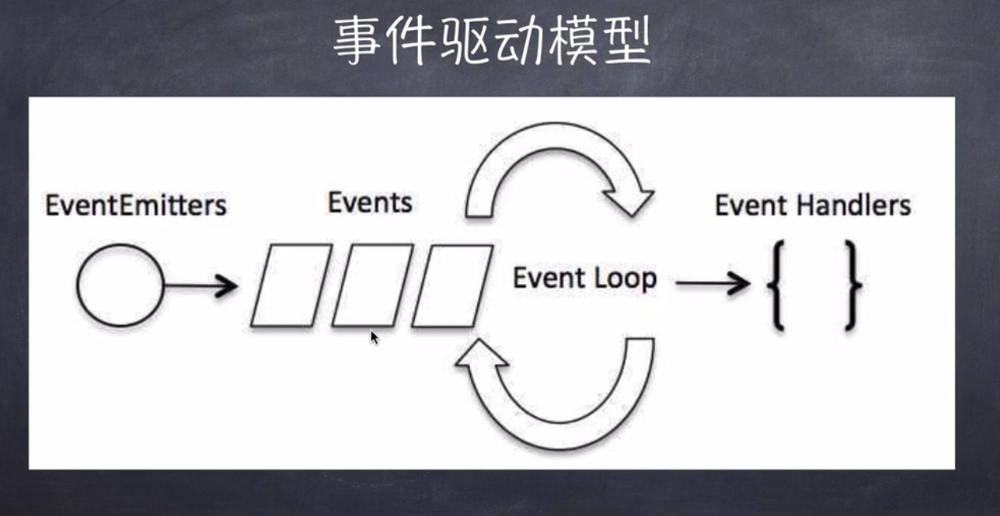

## libuv

## 函数式编程

- 高阶函数
- 偏函数

## V8垃圾回收机制

64位1.4G，32位0.7G。
栈区：64位32M，32位16M。

`process.memoryUsage`

分代式垃圾回收机制：新生代（存活较短），老生代（存活较长）。

### 新生代

scavenge算法

### 老生代

mark-sweep & mark-compact

### 常见的内存泄漏

- 无线增长的数组
- 无限制设置属性和值
- 任何模块内的私有变量和方法
- 大循环

### PM2

### node集群

- 网络层负载均衡（nginx）
- pm2
- vanish、stupid
- java
- DB
- 。。。

### 事件驱动模型

